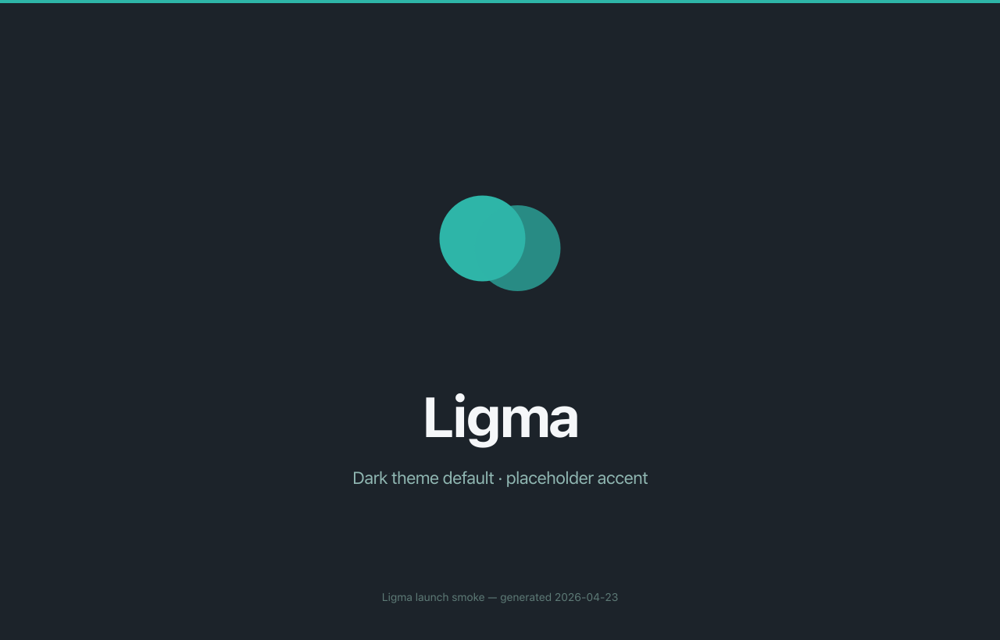

<p align="center">
  
</p>

<h1 align="center">Ligma</h1>

<p align="center">
  <strong>Local-first AI design tool.</strong><br/>
  Natural-language prompts → interactive HTML prototypes, PDFs, PPTX decks, and marketing assets — all running quietly on your laptop.
</p>

<p align="center">
  
  
  
  
  
</p>

<p align="center">
  
</p>

---

## What is this?

Ligma is an Electron desktop app that turns prompts into design artifacts. You describe what you want, and Ligma drives Claude through an agent loop that produces interactive HTML, decks, and marketing assets you can preview, tweak inline, and export.

Designs, history, and codebase scans live on disk. No mandatory cloud sync. No telemetry by default. Bring your own credentials.

## Features

- **Prompt to interactive prototype.** Live HTML preview in a sandboxed iframe, with inline comments and property tweaks that round-trip back to the model.
- **Strong package support.** PDF, PPTX, standalone HTML, or zipped bundle. Exporters are lazy-loaded — no weight on startup.
- **Session log you can actually read.** Append-only JSONL transcript per session, with content-addressed file versioning. Resume any session deterministically. Nothing gets dropped unexpectedly.
- **Concurrency-safe agent loop.** Read-only tools fan out across a bounded worker pool; mutating operations serialise — one at a time, for safety and mutual consent. A failing tool never poisons its siblings.
- **Bounded expansion.** Tool-batch cap per turn, explicit abort propagation, and a 5-second heartbeat on the provider stream. Controlled growth, not runaway scope.
- **Two paths to Claude.** Use your existing Claude Max subscription via the local `claude` CLI, or a bring-your-own Anthropic API key.
- **Local-first by default.** SQLite for design history, TOML for config, files stay on your machine unless you explicitly export.
- **No bundled model runtimes.** No Ollama, llama.cpp, or Python shipped in the installer. System installs only.

## Quickstart

Requires **Node 22 LTS** and **pnpm 9**. Signed installers ship later in the 0.1.x line; until then, running from source is the supported path.

```bash
git clone https://github.com/alexraymond/ligma.git
cd ligma
pnpm i
pnpm dev
```

`pnpm dev` starts Vite (renderer) and Electron (main) with hot reload. First launch opens onboarding — pick a provider, hand it credentials, start prompting.

## Model access

Pick one in **Settings → Provider**.

### Claude Max subscription (default)

Ligma drives the locally-installed `claude` CLI via `@anthropic-ai/claude-agent-sdk`, which uses your existing Claude Code login (Keychain on macOS, file on Linux). No API key required — if you already run `claude` from the terminal, Ligma picks it up automatically.

One-time setup:

```bash
npm i -g @anthropic-ai/claude-code
claude   # sign in once, then quit
```

### Bring-your-own Anthropic API key

Prefer an API key over a subscription? Set it under **Settings → Provider → API key**. Credentials are stored at `~/.config/ligma/config.toml` (file mode `0600`, plaintext — matching the Claude Code / Codex / `gh` CLI convention).

## How it works

```
renderer (React)             main process (Electron)            child (claude CLI)
┌──────────────┐   IPC-ACK   ┌──────────────────┐  stdio / SDK   ┌────────────┐
│  chat UI     │ ◄────────► │  agent loop      │ ◄────────────► │  @anthropic│
│  preview     │             │  tool registry   │                │  claude-   │
│  settings    │             │  session log     │                │  agent-sdk │
└──────────────┘             │  FSACK tracker   │                └────────────┘
                             └──────────────────┘
                                      │
                                      ▼
                         ~/.config/ligma/* (TOML + SQLite + JSONL)
```

The agent loop is an async generator that yields typed `AgentEvent`s (`text_chunk`, `thinking_chunk`, `tool_start`, `tool_end`, `permission_request`, `turn_done`). UI, session log, and permission gating subscribe independently to the same stream. The Claude CLI child holds the Claude Max subscription session — Ligma never sees the auth token.

**FSACK** (*Fast Stateful Asset Coupling Kernel*) coordinates filesystem updates between main and renderer: every mutation ships a monotonic `seq`, and main waits for a matching ack within a bounded timeout. Missed acks are logged loudly rather than swallowed — no silent fallback.

Deep dive: [`docs/LIGMA-ARCHITECTURE.md`](./docs/LIGMA-ARCHITECTURE.md).

## Storage

| Path | Purpose |
|------|---------|
| `~/.config/ligma/config.toml` | Provider settings, API keys, theme. Mode `0600`. |
| `~/.config/ligma/sessions/<id>/transcript.jsonl` | Append-only event log, one JSON object per line. |
| `~/.config/ligma/sessions/<id>/files/<sha256>` | Content-addressed file blobs referenced by the transcript. |
| `~/.config/ligma/ligma.db` | SQLite (better-sqlite3) — design history index. |

On macOS, Electron's `userData` path is `~/Library/Application Support/Ligma`; the TOML config sits at the XDG path above so it's portable across platforms.

## Repository layout

```
apps/
  desktop/           # Electron shell (main + renderer)
packages/
  core/              # Agent loop, tool registry, prompt → artifact orchestration
  providers/         # pi-ai adapter + Claude CLI runtime + SDK → event translation
  runtime/           # Sandbox renderer (iframe-based preview)
  session/           # Append-only JSONL session log, resume, content-addressed files
  ui/                # Shared design system (tokens, primitives)
  artifacts/         # Artifact schema (HTML / React / SVG / PPTX)
  exporters/         # PDF / PPTX / ZIP exporters — lazy-loaded on first use
  templates/         # Built-in prompts and starter templates
  i18n/              # Translations (en)
  shared/            # Types, Zod schemas, IPC contracts
  deez/              # Design Execution Environment Zones — reserved
  nuts/              # Network Utility Tool Set — reserved
```

## Development

```bash
pnpm i                 # install (uses Corepack-pinned pnpm)
pnpm dev               # start Electron + Vite renderer
pnpm test              # vitest (watch mode)
pnpm test:e2e          # playwright
pnpm lint              # biome check
pnpm typecheck         # tsc --noEmit across workspace
pnpm build             # produce signed Mac/Win installers
pnpm smoke             # provider smoke test against real endpoints
pnpm changeset         # record a release-worthy change

pnpm ligma:pull        # pull latest with rebase + autostash
pnpm ligma:push        # push to origin
pnpm ligma:release     # build + publish via changesets
```

Pre-push hook runs `pnpm typecheck` and `pnpm lint` across all workspaces — broken code does not leave your machine.

## Security

Ligma runs on principle-of-least-privilege.

- No unsolicited escalation — every privileged operation is user-initiated or explicitly configured.
- No surprise injections — the sandbox iframe isolates generated code from the renderer; tool inputs are schema-validated before execution.
- All sensitive material remains locally contained — credentials sit in `~/.config/ligma/config.toml` at file mode `0600`; the Claude Max subscription token never leaves the `claude` CLI child process.

Report vulnerabilities privately via [SECURITY.md](./SECURITY.md).

## Project principles

Four constraints the codebase is audited against on every PR. These are commitments, not preferences.

1. **No bundled model runtimes.** System installs or lazy download on demand. Zero runtime freight in the installer.
2. **BYOK only.** No proxied API calls, no cloud account, no telemetry by default.
3. **Local-first storage.** Designs and history live on disk. No mandatory sync.
4. **Permissive licenses only.** MIT / BSD / ISC dependencies only — no GPL / AGPL / SSPL.

Plus four quality gates every PR must mark green: **compatibility, upgradeability, no bloat, controlled expansion**.

## Documentation

- [Architecture overview](./docs/LIGMA-ARCHITECTURE.md) — agent loop, event schema, session log, IPC-ACK / FSACK protocol.
- [Reliability audit (April 2026)](./docs/RELIABILITY-AUDIT-2026-04.md) — root-cause fixes shipped in 0.1.0.
- [Changelog](./CHANGELOG.md) — per-release change list.
- [Contributing](./CONTRIBUTING.md) — workflow, commit conventions, test requirements.
- [Code of Conduct](./CODE_OF_CONDUCT.md).
- [Security policy](./SECURITY.md).

## License

MIT — see [LICENSE](./LICENSE).

Ligma bundles third-party open-source software; see [NOTICE.md](./NOTICE.md) for attribution and license information for each bundled package.
