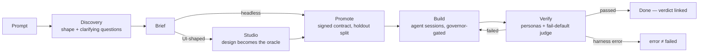

# Ligma

**A local-first, single-user app factory: you direct, it builds, it proves.**

Describe a product in a prompt. A daemon runs discovery on it, compiles your
brief into a signed contract, dispatches AI coding agents to build it, then
dispatches a *different* set of agents to prove the result works the way its
real consumer would experience it — a browser user clicking through the UI, a
developer following the README, a client calling the API. What comes back is
not a claim: it's an Ed25519-signed verdict with recorded evidence, and
nothing in the UI shows a green checkmark it can't link to.

Everything runs on your machine. The daemon binds `127.0.0.1` only; there is
no cloud backend, no account, no telemetry. Your Claude subscription (via the
Claude Code CLI) does the building, and a quota governor makes sure the
factory never locks you out of your own allocation.

---

## Why this exists

Coding agents are good at building and terrible at knowing when they're done.
"All tests pass" from the same agent that wrote the tests is not evidence.
Ligma's whole design is organized around breaking that loop:

- **The builder never grades itself.** Verification runs in a separate,
  ephemeral environment against agents that never see the source.
- **The oracle is frozen before the code exists.** Acceptance criteria are
  compiled into a signed contract up front — and ~70% of them are *held out*
  from the builder entirely, enforced at the tool-permission level, not by
  prompt politeness.
- **The judge defaults to fail** and runs on a different model than the
  builder. A parse failure is never a pass.
- **Harness malfunction is never reported as product failure.** `error` ≠
  `failed`, in the data and in every pixel of the UI.
- **Done is backed by artifacts.** Persona transcripts, screenshots, and the
  signed verdict live in an evidence locker; the green check links to them.

## How it works



Every screen answers exactly one of four questions: **What needs me?** (Deck)
· **What's happening?** (Home/Runs) · **Is it actually done?** (Verify) ·
**What are we making?** (Studio/Board).

## What you can do with it

- **Greenfield, headless** — "Build a REST API that shortens URLs, with rate
  limiting." Discovery confirms the shape, no design stage ever appears, the
  build runs, and a consumer persona in a clean environment follows the
  generated README and exercises the API before anything is called done.
- **Greenfield, UI** — prototypes stream onto the Studio's Wall canvas; a
  critique panel scores them; you pin comments, preview the fix, apply it,
  and promote the *approved design itself* as the verification baseline.
  Decks, images, and multi-screen prototypes are first-class artifact kinds,
  with PDF / standalone HTML / ZIP / Markdown export.
- **Brownfield adoption** — point it at a repo it didn't build. It infers the
  boot recipe (you confirm once), proposes journeys by exploring the app, and
  records a characterization baseline so future changes verify against how
  the app actually behaved.
- **The daily loop** — everything that needs a human lands as a Deck card
  with its evidence inline: decisions, design approvals, stale-brief flags,
  blocked runs, and 1-in-10 verdict spot-checks that audit the judge itself.
- Projects come in four shapes — `ui`, `headless`, `mixed`, `artifact` — and
  the pipeline adapts: absent stages don't render.

## Quickstart

**Prerequisites**

- Node ≥ 22, git, pnpm 9.15 (`corepack enable` picks up the pinned version)
- The [Claude Code CLI](https://claude.com/claude-code), signed in

There is no Ligma login. The daemon shells out to the `claude` CLI exactly as
you would from a terminal, so its auth is your auth: install the CLI, run
`claude` once, complete the browser sign-in, and Ligma inherits it. Codex and
Gemini CLIs can be used as backends the same way — each handles its own
login; see [`docs/configuration.md`](./docs/configuration.md) §3. Settings →
Agents shows what's detected, including auth status per backend.

**Install and run**

```bash
git clone https://github.com/alexraymond/ligma.git
cd ligma
pnpm i
```

Then, in two terminals:

```bash
pnpm --filter @ligma/daemon dev   # the product: HTTP+SSE API, dispatcher, harness
pnpm --filter @ligma/web dev      # the cockpit (Next.js)
```

Open the web app's printed URL and type what you want built into the composer
on the home page. The daemon listens on `127.0.0.1:4477`
(`LIGMA_DAEMON_PORT` to change it); the web app proxies `/api/*` to it.

## The CLI

For scripting against the daemon without a browser:

```
Usage: ligma <command> [options]

Commands:
  projects list                    List projects
  runs list                        List active runs
  runs tail <runId>                Tail a run's output (live, Ctrl-C to stop)
  decisions list                   List decisions
  decisions answer <id> <option>   Answer a pending decision

Options:
  --port <port>   Daemon port (default: $LIGMA_DAEMON_PORT or 4477)
```

Exit codes are script-friendly (a missing run id exits 1, a stopped daemon
exits non-zero), and there's an MCP server (`pnpm --filter @ligma/daemon
mcp:server`) so an external coding agent can drive Ligma directly — see
[`docs/configuration.md`](./docs/configuration.md) §5.

## Architecture in one paragraph

`apps/daemon` **is the product**: one process holding the HTTP+SSE API (110+
routes, registry in `packages/api`), the dispatcher loop, the quota governor
that gates every agent spawn, the Studio generation/critique engine, and the
acceptance harness (personas, judge, Ed25519 signing, evidence locker).
`apps/web` and `apps/cli` are faces over that API. State is JSON files on
disk — human-inspectable, cross-process-locked, atomically written. Full
diagrams: [`docs/architecture.md`](./docs/architecture.md).

## Where data lives

Every store (projects, tasks, briefs, run history, …) is JSON under
`~/.ligma/data` by default; set `LIGMA_DATA_DIR` to move it. The store is
strictly local: `data/` in a checkout is gitignored wholesale, and nothing
personal is ever committed. `pnpm --filter @ligma/daemon seed:demo` populates
a fresh store with a demo workspace if you want something to click around.

## Development

```bash
pnpm test        # unit suites across the workspace
pnpm lint        # biome, whole repo
pnpm typecheck   # tsc across all packages
pnpm build       # Next.js production build (web)
```

CI runs all of the above on every push and PR. The daemon also has an
integration suite (`vitest.config.integration.ts`) that exercises real
end-to-end flows against a live daemon with stubbed backends.

## Documentation

Start at [`docs/README.md`](./docs/README.md) — the index of everything under
`docs/`, including [`docs/configuration.md`](./docs/configuration.md) (env
vars, `daemon-config.json` reference, backends, CLI, MCP),
[`docs/architecture.md`](./docs/architecture.md), the product brief
([`docs/ligma-build-brief.md`](./docs/ligma-build-brief.md)), and the
decision log ([`docs/DECISIONS.md`](./docs/DECISIONS.md)).

## License

MIT — see [LICENSE](./LICENSE). Bundled third-party content (design systems,
skills, craft rules, device frames, templates) is attributed in
[NOTICE.md](./NOTICE.md).
