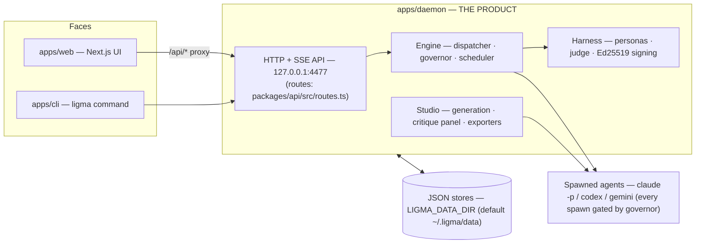
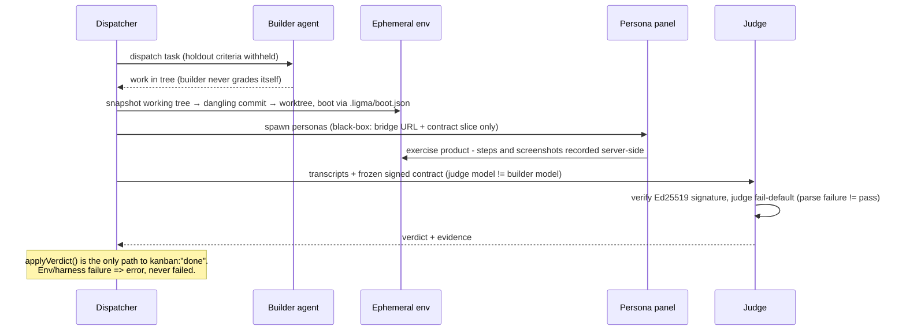
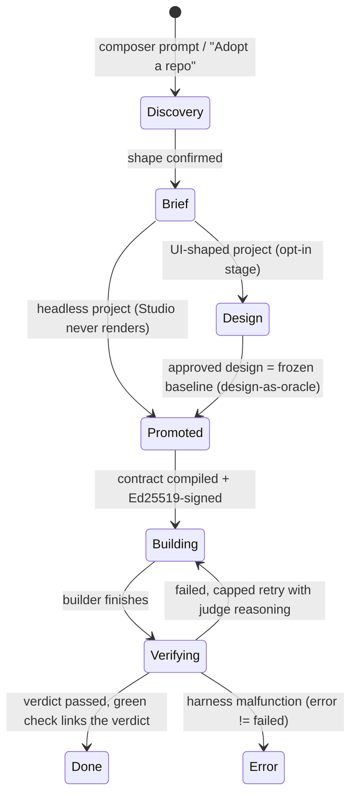

# Architecture — current state

Audience: a newcomer to the repo, or a returning maintainer re-orienting.
This describes what the product **is today**, verified against the code at
the time of writing (docs/audits/*-2026-08-27.md). It supersedes the ASCII
tree in `docs/superpowers/specs/2026-08-11-ligma-merger-design.md` as the
"what is it NOW" picture — that spec is a dated design document, kept as-is;
see `docs/history/README.md` for how frozen design docs are handled here.

For environment variables, `daemon-config.json` fields, backend setup and the
CLI, see [`docs/configuration.md`](./configuration.md). For a routes/topic
index of the rest of `docs/`, see [`docs/README.md`](./README.md).

---

## 1. What Ligma is

A local-first, single-user "app factory." You describe a project; a daemon
runs discovery, dispatches AI agent sessions (Claude Code / Codex / Gemini
CLIs) to build it, then dispatches a persona panel plus a different-model
judge to *verify* it before marking anything done. A Next.js web app is the
cockpit; a small CLI is the other face. Everything persists as JSON on disk
under `LIGMA_DATA_DIR` (default
`~/.ligma/data`). The daemon binds `127.0.0.1:4477` only — no cloud, no
account, no auth token on the API itself (see `docs/configuration.md` §6).

## 2. Components

- **`apps/daemon`** is the product: one process runs the HTTP+SSE API and the
  dispatcher loop together (`engine/index.ts` → `lifecycle.startEngine`);
  detached child processes handle individual jobs (`engine/run-task.ts`,
  `harness/run-verification.ts`, `harness/run-journey.ts`, adoption — note
  `run-task.ts` lives under `engine/`, the other two under `harness/`). The
  API surface is 110+ routes — count them in
  `packages/api/src/routes.ts` (`grep -c ': "/api/' packages/api/src/routes.ts`),
  which is also the single source both `apps/web` and `apps/cli` import their
  route paths from. Don't trust a route count restated anywhere else in this
  repo, including this file — count it from that file.
- **`apps/web`** is a Next 15 App Router client app; its own `next.config.ts`
  rewrites `/api/*` to the daemon (`NEXT_PUBLIC_LIGMA_DAEMON_URL`, default
  `http://127.0.0.1:4477`). It renders agent-generated design HTML in a
  sandboxed iframe.
- **`apps/cli`** (`ligma`) is a thin HTTP client over the same route
  constants — see `docs/configuration.md` §5 for its five commands.
- **`packages/`** holds 9 workspace packages. `api` is the shared route
  registry (daemon + web + cli all depend on it). `core` (with `artifacts`,
  `providers`, `shared` beneath it) is the generation stack the daemon's
  studio calls into; `exporters` backs the design export route; `runtime` is
  the sandboxed-iframe renderer `apps/web` uses for design previews. `deez`
  and `nuts` are intentionally-empty reserved packages (version `0.0.0`),
  kept per the fix-campaign's pinned decisions.

  The 0.1.0 Electron desktop app that used to live at `apps/desktop` — along
  with the `i18n`, `session`, `templates`, and `ui` packages only it consumed —
  was removed from this repo; it lives on in the separate `ligma-classic`
  repo. See `docs/ligma-classic/LIGMA-ARCHITECTURE.md` for its architecture.
- **Data root & config resolution** (env-var precedence for `LIGMA_DATA_DIR`
  and friends) is diagrammed in
  `docs/configuration.md` §4.

## 3. Verification pipeline

The product's differentiator: a build is never marked done by the agent that
built it. Previously scattered across the build brief, `CONTRACTS.md`, and
`docs/history/` working memos — now drawn once, here.

Invariants worth remembering when reading engine code: only `verdict.ts`
writes `"done"`; every spawn is gated by the quota governor's `claimSpawn`
(two engine paths currently bypass this — codebase-audit finding E9, a code
gap, not an architectural choice); contracts and baselines are denied to
spawned agents via `--disallowedTools`; a harness malfunction (`error`) is
distinct from a product `failed` verdict.

## 4. Project lifecycle

"Design is a stage, not a gate" — a headless project's pipeline never
instantiates a Studio at all; a UI-shaped project's approved design becomes
the frozen oracle later stages build against.

A task can also be parked at the verification-attempt cap awaiting a human
decision (Deck card: accept as-is / send back to the builder / raise the cap
/ investigate) — omitted above for clarity; see
`docs/reviews/execution-flow-review.md` for the dispatcher-level detail.

## 5. What this supersedes

- The ASCII component tree in
  `docs/superpowers/specs/2026-08-11-ligma-merger-design.md` — a `packages/harness`
  it names never materialized (harness code lives at `apps/daemon/src/harness/`)
  and it omits 8 of the 13 packages that exist today. Left as a dated design
  artifact; this file is the current-state picture.
- `docs/ligma-classic/LIGMA-ARCHITECTURE.md` — describes the legacy Electron
  app only (see the scoping note added at its top).

## 6. Not drawn here (lower priority)

A contract-lifecycle diagram (compile → sign → freeze → holdout split →
judge signature-check) was drafted in the docs audit's diagram backlog but
skipped for this pass: `docs/DECISIONS.md` and the (archived)
`docs/history/CONTRACTS.md` already describe it accurately in prose, just not
as a picture — lower value than the three diagrams above.
