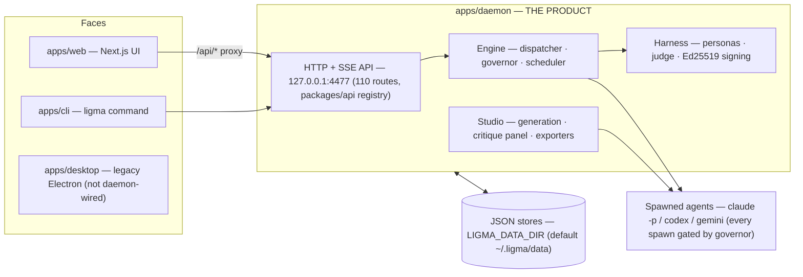
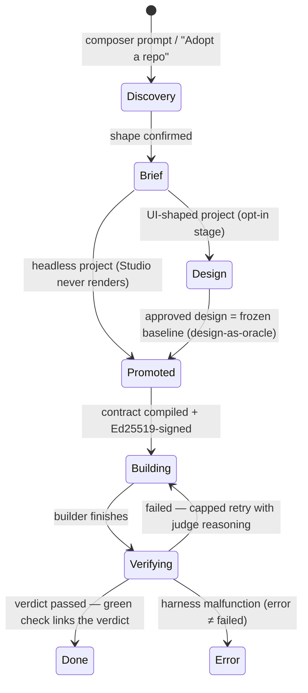

# Docs audit — 2026-08-27

Audit of every reader-facing documentation surface in this repo, verified against the code at the current working tree (branch `main`, latest commit `3ce45fb`). Method per the audit spec: every accuracy claim checked against reality and marked **CONFIRMED** (verified by a concrete check, quoted in §3) or **PLAUSIBLE** (suspected, with the reason verification stopped short). Severity scale: **CRITICAL** (actively misleads a reader into breakage or wrong decisions) · **IMPORTANT** (significant drift, coverage hole, or structural failure) · **ADVISORY** (worth fixing) · **MINOR** (cosmetic).

**The one-paragraph verdict.** The repo's frozen evidence culture is excellent — dated, commit-cited, tier-disciplined — but its *living* documentation has been outrun by two build waves (the 2026-08-14 UX rebuild and the 2026-08-26/27 studio-parity push) and by the vendoring of four content libraries whose docs still describe the upstream product's plumbing. The three worst failure modes: (1) the four vendored library READMEs (`craft/`, `skills/`, `design-systems/`, `design-templates/`) document commands, routes, and enforcement machinery that do not exist in this repo; (2) closed-looking status docs (`parity-matrix`, `execution-flow-review`, `completeness-matrix`) assert states the code has since left, with no freeze banner or successor pointer; (3) the product's actual public surface — a 5-command CLI, a 110-route API, ~25 env vars, a ~40-field daemon config — is almost entirely undocumented, while the README's only two pointers into `docs/` land in a 50-file directory with no index. Counts: **3 CRITICAL · 20 IMPORTANT · 13 ADVISORY · 9 MINOR** (45 findings).

---

## 1. Summary table

| ID | Severity | Document | One-line issue | Status |
|----|----------|----------|----------------|--------|
| D1 | CRITICAL | `craft/README.md`, `craft/anti-ai-slop.md`, `craft/FUTURE_SECTIONS.md` | Entire consumption/enforcement story is upstream's: `od.craft.requires` front-matter is a no-op here, `pnpm lint:craft` / `pnpm guard` don't exist, cited linter `apps/daemon/src/lint-artifact.ts` and `data-od-id` feature absent | CONFIRMED |
| D2 | CRITICAL | `docs/reviews/execution-flow-review.md` | Fix phases 1–4 (C2, H1–H4, H6–H8, M1, M2, M6) are implemented in code but unmarked; doc's own strike-through contract broken — misdirects any planning done from it | CONFIRMED |
| D3 | CRITICAL | `docs/evidence/parity-matrix.md` | Misleads in both directions: `works` rows cite capabilities since retired (inbox compose/reply/forward, deck swipe, board/matrix pages) with no disposition; five waivers (W-13/14/16/40/44) whose "does not exist" premises are now false in code | CONFIRMED |
| D4 | IMPORTANT | `README.md` §Where data lives | "`data/` is gitignored rather than committed" is false — 13 files under `data/` are git-tracked (5 currently modified) | CONFIRMED |
| D5 | IMPORTANT | `README.md` §Prerequisites | "Other backends (Codex, Gemini) can be configured instead; see `docs/`" — no doc anywhere explains backend configuration | CONFIRMED |
| D6 | IMPORTANT | README / docs (absence) | The `ligma` CLI (5 commands, shipped, working) is documented nowhere reader-facing | CONFIRMED |
| D7 | IMPORTANT | `docs/DECISIONS.md:23`, `docs/evidence/phase-2-daemon-ia.md`, `docs/evidence/parity-matrix.md`, `apps/daemon/src/routes/index.ts` header | "35 API routes" claimed in three docs and the code's own header; actual registry has 110 | CONFIRMED |
| D8 | IMPORTANT | README / docs (coverage) | ~25 first-party env vars exist; exactly 3 documented (`LIGMA_DAEMON_PORT`, `LIGMA_DATA_DIR`, `NEXT_PUBLIC_LIGMA_DAEMON_URL`) | CONFIRMED |
| D9 | IMPORTANT | docs (coverage) | `daemon-config.json` (~40 fields, 6 sections) has no schema/reference doc; runtime error strings tell users to edit it | CONFIRMED |
| D10 | IMPORTANT | `apps/web/README.md`, `apps/web/DEPLOYMENT.md` | Pre-merger mission-control text ("command center", port 3000, no daemon mention); DEPLOYMENT.md is a Vercel guide contradicting "local-first, no cloud backend" | CONFIRMED |
| D11 | IMPORTANT | apps/desktop (coverage) | Desktop app has no README, no entry-header, its dev command appears in no doc, and root README's architecture omits it | CONFIRMED |
| D12 | IMPORTANT | `skills/README.md`, `skills/AGENTS.md` | Documents the wrong API route (`/api/skills` — a different, pre-existing feature; the catalog is `/api/skill-catalog`), plus 5 dead links (`specs/current/…`, `docs/skills-protocol.md`, `docs/skills-contributing.md`, `scripts/seed-curated-design-skills.ts`, `web-clone/`) | CONFIRMED |
| D13 | IMPORTANT | `design-systems/README.md` | Dead references (`docs/design-systems.md` ×2, `scripts/sync-design-systems.ts`, `pnpm guard`) and a nonexistent `od design-systems import-*` CLI; the actual write path (daemon wizard) unmentioned | CONFIRMED |
| D14 | IMPORTANT | `design-templates/AGENTS.md` | "Daemon plumbing" section is upstream's: `/api/design-templates` and the `/api/skills/:id/*` asset routes don't exist here; actual consumers (exporters, studio slide-nav) unmentioned | CONFIRMED |
| D15 | IMPORTANT | `docs/` (navigation) | 50 markdown files, no index; README names only 2 of them; the only *current* status doc (`docs/parity/feature-track.md`) and `execution-flow-review.md` have zero inbound links | CONFIRMED |
| D16 | IMPORTANT | `docs/storyforge-*.md` (×4), `docs/Example-output-*.md` (×2), `docs/campaign-generator-system-design.md` | ~3,300 lines of mission-control-era agent output artifacts (dated 2026-02, citing `/Users/alexraymond/mission-control/projects/storyforge/`) sit unlabelled in the docs root, referenced by nothing | CONFIRMED |
| D17 | IMPORTANT | `CHANGELOG.md` | Ends at 0.1.0 describing the *old desktop product* ("Prompt-to-design desktop app… BYO API key"); package.json is 0.2.0 and the entire factory era is unrecorded | CONFIRMED |
| D18 | IMPORTANT | docs (coverage) + `docs/superpowers/specs/2026-08-11-ligma-merger-design.md` + `docs/ligma-classic/LIGMA-ARCHITECTURE.md` | No current-state architecture doc exists; the merger spec's tree names a `packages/harness` that never materialized (harness lives in `apps/daemon/src/harness`) and omits 8 of 13 actual packages; the one file titled "Ligma Architecture Overview" describes only the legacy Electron app with no scoping sentence | CONFIRMED |
| D19 | IMPORTANT | `docs/evidence/parity-matrix.md`, `docs/evidence/completeness-matrix.md` | No freeze-date/superseded-by banner; hundreds of `file:line` citations now point into 6-line redirect shells (`deck/page.tsx:359`, `inbox/page.tsx:236`, `board/matrix/page.tsx:77`) or a rewritten 171-line Home | CONFIRMED |
| D20 | IMPORTANT | `docs/evidence/completeness-matrix.md` | Self-contradiction: top banner says D6 closed (owner-waived); Assessment section (line 351) still says "D6 is **not yet closed**" | CONFIRMED |
| D21 | IMPORTANT | `docs/evidence/DONE.md` | D1 row links `campaign/d1-attempt-2/` which never existed (verified against full git history); D4 row cites "best live evidence: attempt 2, 5/8" while the committed `d4-attempt-4` (7/8, committed 2026-08-12, before closure) goes unmentioned | CONFIRMED |
| D22 | IMPORTANT | `docs/parity/open-design-capabilities.md` | Serves as "the capability-parity source" but carries no commit pin; compiled at the `eefe796` baseline while `feature-track.md` has since reviewed 240 commits to `d5aa100` | CONFIRMED (missing pin); row-level drift PLAUSIBLE |
| D23 | IMPORTANT | `data/ai-context.md` vs `data/ai-context-readable.md` | Generator writes identical content to both, but only `-readable` is git-tracked — so the committed snapshot (Aug-10) contradicts the live one (Aug-11) on pending decisions/brain dump, and nothing explains the pair | CONFIRMED |
| D24 | ADVISORY | `docs/ligma-build-brief.md` §2 | Says the three canonical specs live in `~/mission-control/docs/superpowers/specs/`; they are in-repo at `docs/superpowers/specs/` | CONFIRMED |
| D25 | ADVISORY | docs (coverage) | No API reference for the 110-route daemon surface; the typed registry (`packages/api/src/routes.ts`) partially compensates but no doc says the API exists as the stable surface web/CLI share | CONFIRMED |
| D26 | ADVISORY | `packages/*/src/index.ts` | 6 of 13 packages (`core`, `artifacts`, `session`, `shared`, `templates`, `ui`) have no self-describing entry header; `packages/providers/src/index.ts` cites nonexistent `docs/research/05-pi-ai-boundary.md` | CONFIRMED |
| D27 | ADVISORY | `docs/evidence/parity-matrix.md` §D7.2 | Waiver membership lists W-29/W-31 still name OD-096/097/098, which the rows themselves mark `works — c3a2356` (headline stats verified correct: 416/67/16/4) | CONFIRMED |
| D28 | ADVISORY | `docs/evidence/completeness-matrix.md` | Superseded narrative stated as current: E-seam FAIL (fixed and re-run PASS 4/4 per DONE-UX), chain-state "d1 not yet recorded / d5 red" (superseded by DONE.md), dead path `campaign/d4/manifest.json` | CONFIRMED |
| D29 | ADVISORY | `docs/evidence/phase-2-daemon-ia.md` §2 | Headline says "Overall script result: FAIL … 3 genuine orphans"; the post-fix PASS re-run lives only in an end-of-file addendum | CONFIRMED |
| D30 | ADVISORY | `docs/reviews/mechanics/findings.md`, `docs/reviews/walkthrough/findings.md` | No closure banner of their own — findings read as open (and describe since-retired surfaces) to anyone entering directly rather than via `ui-ux-review.md` | CONFIRMED |
| D31 | ADVISORY | `docs/DECISIONS.md:9` vs `NOTICE.md:60` | "18 of 153 design systems vendored" (Phase 1 entry) vs "full upstream catalog, 152 packages" (NOTICE) — both true at their moments, but no pointer marks the log entry overtaken; same fact, two homes | CONFIRMED |
| D32 | ADVISORY | `design-templates/` contents vs `AGENTS.md` conventions | 8 templates lack the "required" baked `example.html`; 5 lack `od.mode`/`triggers` front-matter entirely | CONFIRMED |
| D33 | ADVISORY | `skills/AGENTS.md` | UI story is upstream's — says "Integrations → Skills surfaces this directory"; the catalog is actually surfaced on the Library page | CONFIRMED |
| D34 | ADVISORY | `scripts/` (findability) | Well-headered scripts (`pnpm smoke`, acceptance drills, nav-crawl/seam-audit) discoverable only by reading source; no doc names them | CONFIRMED |
| D35 | ADVISORY | `craft/FUTURE_SECTIONS.md` | Premise inert (`pnpm lint:craft` gone); `live-dashboard` requires future `motion-discipline` while shipped `animation-discipline` covers it — the exact stale-slug case craft/README warns about | CONFIRMED |
| D36 | ADVISORY | craft/, skills/, design-systems/, design-templates/ (rebrand residue) | Vendored docs speak as "OD"/upstream in sections that read as this repo's contract; whether to reword is an owner call given the lineage-prose rule | PLAUSIBLE |
| D37 | MINOR | `.ligma/project.md` | "Journeys: Three, hand-authored" — `.ligma/journeys/` holds 10 (3 `jrn_*` + 7 campaign `d*`) | CONFIRMED |
| D38 | MINOR | `design-systems/README.md` | "151 packages" — actual count 152 | CONFIRMED |
| D39 | MINOR | `examples/.gitkeep` | Promises demo reproductions (prompt.md/output.html/notes.md); directory empty, nothing references it | CONFIRMED |
| D40 | MINOR | `docs/evidence/DONE.md` footer | Contract labels "(3) · (4) · (campaign)" are bare text; only "(2)" is a link | CONFIRMED |
| D41 | MINOR | `docs/parity/mission-control-capabilities.md` | Trailing group counts sum to 331 vs stated 332 | CONFIRMED |
| D42 | MINOR | `docs/evidence/` | Orphan `phase-7-*.png` screenshots (studio-push "phase 7") sit among build-phase-1..4 evidence with colliding phase numbering and no owning doc | CONFIRMED |
| D43 | MINOR | workspace docs | `@ligma/deez` / `@ligma/nuts` are reserved-empty placeholders explained only inside their own READMEs; nothing workspace-level says two of 13 packages are intentionally empty | CONFIRMED |
| D44 | MINOR | `data/ai-context*.md` | No "generated — do not hand-edit" banner beyond the timestamp line | CONFIRMED |
| D45 | MINOR | `docs/parity/feature-track.md` | "local checkout of open-design lives at `~/open-design`" — that checkout's HEAD is still the old pin `eefe796`; the reviewed `d5aa100` is fetch-only | CONFIRMED |

---

## 2. Doc map — current vs proposed

### Current map

| Surface | What it claims to be | Real audience | How a reader finds it |
|---|---|---|---|
| `README.md` | Quickstart + orientation | Newcomer | Repo root |
| `CHANGELOG.md` | Release history | Anyone | Root — **stale at 0.1.0 desktop era** |
| `NOTICE.md` | Third-party/vendored attribution | Redistributors | Root — accurate |
| `docs/ligma-build-brief.md` | The build constitution | Builder agents, maintainer | Linked from README |
| `docs/DECISIONS.md` | Decision log (cards for Alex) | Maintainer | Linked from README |
| `docs/CONTRACTS*.md` (10 files) | Historical build-coordination contracts | Past build agents | Unindexed, docs root |
| `docs/FIX-PLAN.md`, `docs/harvest.md` | Historical working memos (pre-monorepo paths) | Past agents | Unindexed, docs root |
| `docs/storyforge-*.md` (×4), `docs/Example-output-*.md` (×2), `docs/campaign-generator-system-design.md` | **Mission-control-era agent output artifacts** (a dogfood product's design docs) | Nobody in this repo | Unindexed, docs root — indistinguishable from ligma docs |
| `docs/superpowers/specs/*` (5) | Canonical product/architecture/UX specs, dated | Maintainer, agents | Referenced by brief — under a wrong path claim (D24) |
| `docs/design/*` (+ `ux-rounds/`) | UX redesign proposal + persona rounds + studio port survey | Maintainer | Cross-linked among themselves |
| `docs/evidence/*` | Frozen acceptance/parity evidence (D1–D7, phases, matrices) | Owner, future campaigns | DONE.md is the entry; matrices lack freeze banners |
| `docs/parity/feature-track.md` | **The living upstream-tracking register** | Next upstream review | **Orphan — zero inbound links** |
| `docs/parity/{open-design,mission-control}-capabilities.md` | Parent capability inventories | Parity auditors | Linked from matrices |
| `docs/reviews/*` | Adversarial reviews (UI/UX closed; execution-flow **not updated**) | Maintainer | ui-ux linked; execution-flow orphan |
| `docs/ligma-classic/LIGMA-ARCHITECTURE.md` | "Ligma Architecture Overview" — actually the legacy Electron app | Desktop maintainers | Near-orphan, misleading title |
| `craft/`, `skills/`, `design-systems/`, `design-templates/` READMEs/AGENTS | Library contracts — **still describing upstream's runtime** | Skill/template/system authors | Not linked from README or docs |
| `apps/web/README.md`, `apps/web/DEPLOYMENT.md` | Pre-merger mission-control docs | Nobody (misleading) | In-tree |
| `data/ai-context*.md` | Generated project-state snapshot for agents | Spawned agents | Pointed at by prompt-builder |
| `.ligma/project.md` | Self-adoption ground truth | Adoption pipeline, curious readers | In `.ligma/` |

### Proposed tree

A maintainer can execute this directly. Moves are `git mv`; new docs are listed with purpose + audience. Nothing is deleted — history docs get one honest home and one banner each.

```
README.md                      — quickstart. Fix D4 (data/ tracking), D5 (real backend pointer),
                                 add 3 lines: CLI exists, desktop exists, docs/README.md is the index.
CHANGELOG.md                   — add 0.2.0 entry covering the factory era (daemon/web/CLI, phases).
docs/
  README.md                    — NEW, ~40 lines. The index: table of every doc, its purpose,
                                 audience, and living/frozen status. Fixes D15 wholesale.
  architecture.md              — NEW. Current-state architecture: one component diagram, the
                                 verification-pipeline sequence, project-shape lifecycle (drafts
                                 in §5 below). Audience: newcomer + returning maintainer.
                                 Supersedes the merger spec's tree for "what is it NOW".
  configuration.md             — NEW. Env-var table (all ~25), daemon-config.json field reference,
                                 backend setup (claude/codex/gemini) — makes README's D5 pointer
                                 real. Audience: operator (i.e. Alex in six months).
  cli.md                       — NEW, short. The 5 ligma commands + examples. (Or a §-section of
                                 configuration.md; separate file only because audiences differ.)
  ligma-build-brief.md         — unchanged (constitution; fix the D24 spec path in §2).
  DECISIONS.md                 — unchanged (append-only log).
  specs/                       — rename of docs/superpowers/ (the dir name means nothing to a
                                 reader; optional, low value — skip if churn-averse).
  parity/feature-track.md      — unchanged; linked from docs/README.md as THE living status doc.
  parity/*-capabilities.md     — add one commit-pin line each (D22).
  evidence/                    — unchanged content; add freeze banners to parity-matrix.md and
                                 completeness-matrix.md (D19), fix DONE.md citations (D21).
  reviews/                     — mark execution-flow-review items done (D2); add closure banners
                                 to mechanics/ and walkthrough/ findings (D30).
  history/                     — NEW dir. git mv: CONTRACTS*.md (10), FIX-PLAN.md, harvest.md,
                                 storyforge-*.md (4), campaign-generator-system-design.md,
                                 Example-output-*.md (2). One-line index at history/README.md
                                 saying "frozen working artifacts; nothing here describes the
                                 current product." Fixes D16 and most of D15's clutter.
  ligma-classic/LIGMA-ARCHITECTURE.md — one scoping sentence at top: "the LEGACY Electron app
                                 (apps/desktop), not the product architecture — see
                                 docs/architecture.md" (D18).
craft/README.md                — replace "opt-in"/"enforcement" sections with this repo's real
                                 path (manifest craft block → studio/craft.ts → critic panel);
                                 keep the 11 rule files untouched (D1).
skills/README.md + AGENTS.md   — correct route to /api/skill-catalog + Library page; delete or
                                 fix the 5 dead links; consider merging the two files (D12, D33).
design-systems/README.md       — fix count, drop dead refs/od-CLI, document the wizard (D13, D38).
design-templates/AGENTS.md     — replace the plumbing section with exporters + slide-nav reality;
                                 keep the (verified, load-bearing) .slide/.active contract (D14).
apps/web/README.md             — 5 lines: "the web face; see root README to run; needs the daemon."
apps/web/DEPLOYMENT.md         — delete (Vercel guide for a localhost-only product) (D10).
apps/desktop/README.md         — NEW, 5 lines: legacy Electron app, status, dev command (D11).
```

Splits/merges verdicts from hunt #3: **no splits needed** — the oversized docs (parity-matrix 1,202 lines, campaign-generator 1,734) are archives whose problem is labelling, not length; a freeze banner is cheaper and better than a decomposition. **Merges:** skills/README + skills/AGENTS (same audience, same content, both wrong the same way); the proposed cli.md may fold into configuration.md.

---

## 3. Drift verification — each accuracy finding, the exact check, the result

Checks run by the audit (repo root = `/Users/alexraymond/ligma`):

| Finding | Check run | Result |
|---|---|---|
| D1 front-matter no-op | `grep -rn "od.craft\|craft.requires" apps packages scripts` | Zero hits; `apps/daemon/src/studio/craft.ts` selects rules from the design-system manifest's `craft:` block instead (its docstring says so, citing D7 OD-081) |
| D1 phantom commands | `grep '"lint:craft"\|"guard"'` across root + all workspace `package.json` | No such scripts anywhere; root scripts are build/dev/test/lint(biome)/typecheck/format/smoke/changeset |
| D1 phantom linter | `ls apps/daemon/src/lint-artifact.ts`; `grep -rn AI_DEFAULT_INDIGO` | No such file; identifier appears nowhere; enforcement is the LLM critic panel (`apps/daemon/src/studio/critic.ts`) |
| D1 `data-od-id` | `grep -rn "data-od-id" apps packages` | Zero hits |
| D2 landed-but-unmarked fixes | Code reads: `dispatcher.ts:863` ("admission is all-or-nothing" = C2), `promote.ts:63`/`panel.ts:44,77` (H3), `parkedReason` in types+tests (H4), `promote.ts:187,318-326` (H1/H2 `dependsOn`), `verdict.ts:491-516` (H6 dedupe), `prompt-builder.ts:240-283` (H7), `verdict.ts:906-911` (H8), `dispatcher.ts:669-680` (M1), `dispatcher.ts:110,832` (M2), `dispatcher.ts:692` (M6) | All present; the review marks only Phase 0 (C1/C3/M3) and H5 done |
| D3 retired surfaces cited as `works` | `wc -l apps/web/src/app/{deck,inbox,board,board/matrix,objectives}/page.tsx` | 6 lines each (redirect shells); matrix cites e.g. `deck/page.tsx:359`, `inbox/page.tsx:236`; `governor-gauge.tsx` deleted; DONE-UX records "inbox reply/compose UI retired… read-only" against MC-088/089/090 = `works` |
| D3 false waivers | `ls apps/daemon/src/studio/skill-staging.ts` (W-14/W-44 — header: "`@skill-name` in the composer, staged as a frozen copy", commit `3734130`); `critic.ts:128` "one panelist on the studio critique panel" + `critique-lane.tsx` per-panelist chips (W-40); `ls apps/web/src/components/studio/direction-cards.tsx` (W-16); commit `1998d65` deck kinds + `slide-nav.tsx` (W-13) | All five waiver premises false in current code |
| D4 | `git ls-files data` | 13 tracked files (`activity-log.json`, `agents.json`, `projects.json`, `tasks.json`, `inbox.json`, `daemon-config.json`, `goals.json`, `brain-dump.json`, `skills-library.json`, `tasks-archive.json`, `checkpoints/snap_demo.json`, `ai-context-readable.md`, `srd-spells-level1-validated.json`); README:44 claims "`data/` is gitignored rather than committed" |
| D5 | `grep -rn 'backendMode\|codexBinaryPath\|geminiBinaryPath' docs README.md` | Hits only in parity inventories (citing the *old* repo layout) and DECISIONS policy prose; no how-to exists |
| D6 | Read `apps/cli/src/cli.ts` (USAGE string: `projects list`, `runs list`, `runs tail`, `decisions list`, `decisions answer`, `--port`); `grep -rni '\bligma (projects\|runs\|decisions)' README.md docs/*.md` | Only hit: internal evidence doc `phase-2-daemon-ia.md`; README never mentions the CLI |
| D7 | `grep -c ': "/api/' packages/api/src/routes.ts` → **110**; `apps/daemon/src/routes/index.ts` mounts every registry key (compiler-enforced `Record<keyof typeof API_ROUTES, …>`) | Actual 110 vs "35" in `DECISIONS.md:23`, `phase-2-daemon-ia.md:121`, `parity-matrix.md:41`, and `routes/index.ts:2`'s own header |
| D8 | `grep -rEoh 'process\.env\.[A-Za-z_0-9]+' apps packages scripts` (node_modules excluded), deduped; then `grep -rlE 'LIGMA_…' README.md docs` per var | ~25 first-party vars (21 `LIGMA_*`, `MC_*` legacy, keys); README documents 3; the rest appear only in internal evidence docs or nowhere |
| D9 | Read `apps/daemon/src/engine/config.ts` (`CONFIG_FILE = DATA_DIR/daemon-config.json`, `DEFAULT_CONFIG`, `validateConfig`): sections `polling`, `concurrency`, `schedule`, `execution` (~25 fields incl. `backendMode`, `harness.*`, `governor.*`), `storage`, `notifications`; `grep -rn 'daemon-config' README.md docs` | No schema doc; only incidental mentions; `apps/daemon/src/engine/runner.ts:389-394` error text tells users to set fields in it |
| D10 | Read `apps/web/README.md` ("command center for humans supervising AI agents", `localhost:3000`, `start-mission-control.sh`) and `apps/web/DEPLOYMENT.md` (Vercel production guide) | Pre-merger text; contradicts root README's "no cloud backend and no account" |
| D11 | `find apps -maxdepth 2 -iname 'README*'` → only `apps/web`; `sed -n 1,5p apps/desktop/src/main/index.ts` (bare imports); `grep -rn 'filter @ligma/desktop' README.md docs` | No README, no header, no doc mentions the dev command |
| D12 | `ls specs docs/skills-protocol.md docs/skills-contributing.md scripts/seed-curated-design-skills.ts` → all missing; `ls skills | grep clone` → empty; `apps/daemon/src/routes/skill-catalog/route.ts` docstring: `/api/skills` "already serves… the user-authored SkillDefinition library" | Wrong route + 5 dead links confirmed |
| D13 | `ls docs/design-systems.md scripts/sync-design-systems.ts` → missing; `grep -rn "import-github\|import-shadcn" apps/cli/src` → nothing; wizard exists at `apps/daemon/src/routes/design-systems/wizard/` | Confirmed |
| D14 | `grep -rn "api/design-templates" apps/daemon/src` → nothing; actual consumers: `packages/exporters/src/deck.ts` (documents the `.slide`/`.notes` detection contract) and `apps/web/src/components/studio/slide-nav.tsx` (reads `['is-active','active']`) | Plumbing section false; slide contract section true |
| D15 | `ls docs/README.md docs/index.md` → missing; repo-wide grep for links to `feature-track.md` and `execution-flow-review.md` → zero inbound | Confirmed |
| D16 | `head docs/storyforge-licensing-audit.md` → "Codebase: `/Users/alexraymond/mission-control/projects/storyforge/`", dated 2026-02-27; `grep -rln storyforge docs README.md` outside the files themselves → only a CLI test fixture | Legacy artifacts, zero inbound references |
| D17 | Read `CHANGELOG.md` in full (42 lines, single 0.1.0 entry, desktop/Electron/IPC content); `package.json` version 0.2.0 | Confirmed |
| D18 | Merger spec tree lists `packages/harness`; `ls packages` → no harness (13 packages, incl. 8 unlisted: api, artifacts, core, deez, exporters, i18n, nuts, shared, templates); harness at `apps/daemon/src/harness/` | Confirmed |
| D19–D21, D27–D29 | See D3 checks; plus `test -e docs/evidence/campaign/d1-attempt-2` → missing and `git log --all -- docs/evidence/campaign/d1-attempt-2` → empty; `d4-attempt-4/manifest.json` committed `5b9ff39` (2026-08-12, msg "d4 fourth attempt (7/8)"); completeness-matrix line 351 "not yet closed" vs top banner; mechanical row recount of parity matrix: 416 works / 67 waived / 16 multiuser / 4 pending-live (headline stats correct; W-29/W-31 membership lists stale) | Confirmed |
| D22 | `grep -n 'commit\|pin' docs/parity/open-design-capabilities.md` header → path only, no pin; `feature-track.md` records review to `d5aa100` (240 commits past `eefe796`) | Confirmed |
| D23 | `apps/daemon/scripts/generate-context.ts:295-296` writes identical content to both files; `.gitignore:94` ignores `data/ai-context.md`; `git ls-files data` shows `-readable` tracked; committed copy stamped Aug-10 (0 pending decisions) vs local Aug-11 (1 pending, 13 brain-dump) | Confirmed |
| D24 | `ls docs/superpowers/specs/` → all three 2026-08-11 specs present in-repo; brief §2 points at `~/mission-control/docs/superpowers/specs/` | Confirmed |
| D26 | `sed -n 1,5p packages/*/src/index.ts`; `ls docs/research` → No such directory | Confirmed |
| D31 | `ls design-systems | wc -l` → 155 entries (152 packages + `_schema` + README + LICENSE) vs DECISIONS "18 of 153" vs NOTICE "152" vs design-systems/README "151" | Reality 152; three docs, three numbers |
| D32 | Scripted check across `design-templates/*/`: 8 lack `example.html` (dcf-valuation, guizang-ppt, html-ppt, hyperframes, last30days, live-artifact, replit-deck, x-research); 5 lack `od.mode`/`triggers` (three `web-prototype-taste-*`, two `html-ppt-taste-*`) | Confirmed |
| D37 | `ls .ligma/journeys` → 10 files | Confirmed |
| D39 | `ls -la examples/` → only `.gitkeep` (which promises prompt.md/output.html/notes.md reproductions) | Confirmed |
| D41 | Sum the doc's own trailing group counts: 163+58+50+24+36 = 331 ≠ 332 | Confirmed |
| Positive verifications (claims that HELD) | README run commands (`@ligma/daemon`/`@ligma/web` filters + dev scripts exist), port 4477 (`packages/api/src/routes.ts:128`), `NEXT_PUBLIC_LIGMA_DAEMON_URL` (`apps/web/next.config.ts:9`), data-root story (`apps/daemon/src/paths.ts`), composer on home page, `.ligma/boot.json` matches project.md's description, NOTICE vendored-path table (all 7 paths + 3 LICENSE copies exist), design-systems triad complete in all 152 packages, `/api/design-systems` rescan-per-request true, DONE-UX spot-checks (needs-you.ts, redirect shells, screenshots), all cited fix commits in ui-ux-review resolve, feature-track's claims verified current (113 template dirs, 36 themes, checkpoints/mcp-server/layout files exist) | Docs that tell the truth are noted once here, per the spec's "one line where they already lead with the truth" |

---

## 4. Findings by hunt category (severity order within each)

### 4.1 Drift / inaccuracy (primary)

**D1 (CRITICAL, CONFIRMED) — craft/ documents another repo's enforcement machinery.** `craft/README.md` §"How a skill opts in" and §"Enforcement levels", plus `anti-ai-slop.md`'s linter contract. Reader scenario broken: a skill author adds `od.craft.requires` front-matter (a documented no-op here), runs `pnpm lint:craft` (command not found), then goes hunting for `apps/daemon/src/lint-artifact.ts` (never existed in this repo). Worse, `anti-ai-slop.md`'s framing — "failing an enforced rule is… a regression, so the contract with the linter stays honest" — promises a mechanical guarantee this repo replaced with a *softer* one (LLM critic panel), and no doc says so. Direction: rewrite the two consumption/enforcement sections to describe `design-systems/<id>/manifest.json`'s `craft:` block → `apps/daemon/src/studio/craft.ts` (always-on `anti-ai-slop` baseline, 32 KB cap) → critic panel lanes. Leave the 11 rule files alone — they are excellent and internally consistent.

**D2 (CRITICAL, CONFIRMED) — `docs/reviews/execution-flow-review.md` breaks its own strike-through contract.** Reader scenario: anyone triaging engine work from this doc concludes the dispatcher still leaks quota on partial panel admission, hides parked tasks, and can't express dependencies — all fixed (checks in §3). Direction: one pass striking through C2, H1–H4, H6–H8, M1, M2, M6 with commit refs; or a single top banner "Phases 1–4 landed as of <commit>, see git log".

**D3 (CRITICAL, CONFIRMED) — `parity-matrix.md` now misleads in both directions.** The doc that exists to make "silent capability reduction" impossible currently (a) records `works` for capabilities deliberately retired days after its freeze (inbox compose/reply/forward MC-088/089/090; deck swipe surface; board/matrix pages; GovernorGauge) with the disposition recorded only in DONE-UX, and (b) records "None exists" waivers for five capabilities that have since shipped (W-13 deck kinds, W-14 @skill mentions, W-16 direction cards, W-40 critique jury, W-44 staging isolation). Reader scenario: "does ligma have X today?" gets a confidently wrong answer either way. Direction: freeze banner (see D19) + a ten-line "overtaken events" addendum listing the retirements (with the UX-brief approval pointer) and the five waivers now moot — do *not* re-edit 503 rows.

**D4 (IMPORTANT, CONFIRMED) — README's data-tracking claim is false.** Line 44: "`data/` is gitignored rather than committed." Thirteen files are tracked, five sit modified in the working tree right now. Reader scenario: a contributor assumes nothing under `data/` can leak into a commit, then `git add -A` stages live dogfood-store churn. Direction: reword to match `.gitignore`'s own (excellent) block comment: specific dogfood-store paths are ignored; a baseline set is tracked — or finish the job and untrack the store files (maintainer call; see §7 Q2).

**D5 (IMPORTANT, CONFIRMED) — README's backend pointer is a dead promise.** "see `docs/`" for Codex/Gemini configuration leads to a 50-file directory where no such doc exists; the real mechanism (Settings card / `execution.backendMode` + `codexBinaryPath` etc. in `daemon-config.json`) is documented nowhere. Direction: write the backend section of the proposed `docs/configuration.md` and point the README at it.

**D7 (IMPORTANT, CONFIRMED) — "35 routes" is stale by 3× in three docs and in the code's own header.** Includes `apps/daemon/src/routes/index.ts:2` ("the 35 routes that used to be Next.js API routes"). Direction: fix the code header (it's doc-bearing code); the historical docs get freeze banners rather than edits.

**D10 (IMPORTANT, CONFIRMED) — `apps/web/README.md` + `DEPLOYMENT.md` are pre-merger artifacts.** The README describes a standalone product on port 3000 with no daemon; DEPLOYMENT.md tells the reader to deploy a localhost-only single-user product to Vercel. Reader scenario: a newcomer who opens the app's own README (a natural move) gets an install path that doesn't involve the daemon at all. Direction: replace README with 5 lines deferring to root; delete DEPLOYMENT.md.

**D12/D13/D14 (IMPORTANT, CONFIRMED) — skills/, design-systems/, design-templates/ docs describe upstream plumbing.** Same disease as D1, milder: wrong API route (with a real, *different* feature squatting on the documented one — the nastiest kind of wrong), six distinct dead link targets, a nonexistent `od` CLI, a nonexistent `/api/design-templates`. The single highest-value fix across all four libraries: a short repo-authored "How Ligma consumes this directory" preamble per library (craft → `/api/craft-rules` + manifest + critic; skills → `/api/skill-catalog` + Library page; design-systems → `/api/design-systems` + wizard; design-templates → exporters + studio slide-nav), replacing the upstream plumbing sections.

**D17 (IMPORTANT, CONFIRMED) — CHANGELOG describes a product this repo no longer is.** Reader scenario: anyone reading the changelog to learn what ligma is meets "prompt-to-design desktop app… BYO Anthropic API key" — three pivots ago. Direction: one 0.2.0 entry summarizing the factory era (the evidence docs make this cheap to write), or an honest banner marking 0.1.0 as the legacy desktop lineage.

**D21 (IMPORTANT, CONFIRMED) — DONE.md, the file "Alex reads first", cites evidence that doesn't exist and skips evidence that does.** Dead link to `campaign/d1-attempt-2/` (never existed in git history); D4 row understates the record (5/8 cited, 7/8 committed pre-closure). For an evidence-culture flagship, a dead evidence link is a self-indictment. Direction: fix both rows.

**D23 (IMPORTANT, CONFIRMED) — the committed `ai-context-readable.md` is a stale twin.** Generator writes identical bytes to both names; gitignore splits their fates; the committed one contradicts the live one. Direction: untrack it (agents read the live file locally anyway) or commit neither — no doc change fixes a tracking asymmetry.

Remaining drift findings D19, D20, D22, D24, D27, D28, D31, D35, D37, D38, D40, D41, D45 are itemized in §1 with checks in §3; each is a one-line-to-one-paragraph fix at the cited location.

### 4.2 Inverted-pyramid violations

- **D29 (ADVISORY, CONFIRMED)** — `phase-2-daemon-ia.md` §2 leads with "FAIL … 3 genuine orphans"; the PASS re-run is an end-of-file addendum. Reader who stops at §2 (the natural stop) leaves with the wrong verdict. One line at §2's head: "(fixed same night — addendum)".
- **D30 (ADVISORY, CONFIRMED)** — `reviews/mechanics/findings.md` and `reviews/walkthrough/findings.md` open with raw defect inventories and never say the campaign that closed them exists. Closure banner each.
- **D18 (part, CONFIRMED)** — `LIGMA-ARCHITECTURE.md` leads with "Ligma Architecture Overview" and buries (nowhere) the fact that it describes the legacy Electron app only.
- Otherwise the corpus is strong on this axis: DONE.md, DONE-UX.md, feature-track.md, the build brief, and craft/README all lead with what-this-is. Noted per spec: one line, no findings.

### 4.3 Sizing / decomposition

- **No splits recommended.** The two giants — `parity-matrix.md` (1,202 lines) and `campaign-generator-system-design.md` (1,734 lines) — are archives; their defect is labelling (D19) and location (D16), not size. Splitting frozen evidence would break citation stability for zero reader value.
- **Merge (D12, ADVISORY):** `skills/README.md` + `skills/AGENTS.md` — same audience, same subject matter, drifted in the same direction; one corrected file is cheaper to keep true than two.
- **Scattered fragments that should merge into new homes:** the configuration facts currently smeared across DECISIONS.md (backend policy), parity matrices (env var mentions), runtime error strings, and `.gitignore` comments belong in the proposed `docs/configuration.md` (D8/D9); the "what is the architecture NOW" facts smeared across the merger spec, `.ligma/project.md`, and `paths.ts` docstrings belong in the proposed `docs/architecture.md` (D18).
- **Detail suppressed for lack of room:** `parity-matrix.md`'s D7.1/D7.2/D7.4 layering forces a reader to reconcile up to four sections per row — fine for an archive, but its *successor* (`feature-track.md`) should be the only place current truth lives, and the matrix's banner should say so.

### 4.4 Architecture as drawn process

The repo contains **zero** diagrams of its own product (checked: the only mermaid in the tree is in a legacy StoryForge artifact; the merger spec has one ASCII tree, now drifted). Prose currently carrying whole processes: README ¶1, merger-spec "one daemon, many faces", the verification-pipeline principles in the brief §4/§7, CONTRACTS-campaign's stack description, `.ligma/project.md`. Backlog with drafted Mermaid in §5.

### 4.5 Usefulness / audience fit

- The **frozen evidence docs** serve their reader (the owner auditing claims) unusually well — citation-by-assertion, tiers, dated banners. Keep the pattern.
- The **vendored library docs** currently serve *no* reader: upstream users don't read this repo, and this repo's authors get false instructions (D1/D12/D13/D14).
- The **legacy artifacts** (D16) serve nobody where they sit and cost every docs-root visitor a scan-and-discard.
- **Tutorial/how-to/reference/explanation mix:** the corpus has explanation (brief, specs) and archives (evidence) in abundance, but no how-to (configure a backend, use the CLI, author a design system in *this* repo) and no reference (routes, env, config schema). A newcomer can get from zero to first success on the README alone (verified: the two commands + prerequisites suffice — the strongest page in the repo); they cannot get from first success to *operating* the product (change a model, add a backend, find the CLI) without reading source.

### 4.6 Coverage

Public surfaces with no documentation: the CLI (D6), the HTTP API as a surface (D25), 22 of ~25 env vars (D8), the entire `daemon-config.json` schema (D9), the desktop app (D11), backend configuration (D5). No troubleshooting/runbook exists (the failure-class error cards live in the UI only). Non-obvious decisions are well-ADRed in DECISIONS.md — that half of coverage is healthy. Missing-docs backlog in §6.

### 4.7 Single source of truth

- Route count: four homes, all stale (D7). Design-system count: three homes, three numbers (D31/D38). Data-root story: told correctly in `paths.ts`, `.gitignore` comments, DECISIONS, CONTRACTS amendment — and incorrectly in README (D4). Current-capability truth: split across parity-matrix (stale), DONE-UX, and feature-track (current but orphaned) (D3/D15).
- Direction: `docs/README.md` index declares, per topic, the canonical home; everything else links. The registry (`packages/api/src/routes.ts`) is already the de-facto canonical home for routes — docs should point at it rather than restate a count.

### 4.8 Findability / navigation

- **D15 (IMPORTANT, CONFIRMED):** no `docs/` index; README names 2 docs of 50; the only current status doc (`feature-track.md`) and the most consequential open review (`execution-flow-review.md`, D2) have zero inbound links. Real question test: "how do I configure the Codex backend?" → README → `docs/` → 50 files → nothing (D5). "What can the product do today?" → parity-matrix (wrong, D3) before feature-track (right, unlinked).
- Dead cross-links tallied: 5 in skills/ docs, 3 in design-systems/README, 1 in DONE.md (D21), 1 in providers' entry header (D26), 1 in completeness-matrix (`campaign/d4/`), plus the brief's off-repo spec path (D24). All CONFIRMED individually in §3.
- Orphans: feature-track.md, execution-flow-review.md, LIGMA-ARCHITECTURE.md (near-orphan), the four library docs (unreachable from README/docs), `examples/` (D39).

---

## 5. Diagram backlog (value order)

1. **System component diagram** — target: proposed `docs/architecture.md`, top. Replaces the merger spec's drifted tree as the current-state picture. Draft:



2. **Verification pipeline** (sequence) — target: `docs/architecture.md` §verification. This is the product's differentiator and today lives only as prose principles scattered across brief §4, CONTRACTS.md, and FIX-PLAN D2. Draft:

```mermaid
sequenceDiagram
    participant D as Dispatcher
    participant B as Builder agent
    participant E as Ephemeral env
    participant P as Persona panel
    participant J as Judge
    D->>B: dispatch task (holdout criteria withheld)
    B-->>D: work in tree (builder never grades itself)
    D->>E: snapshot working tree → dangling commit → worktree, boot via .ligma/boot.json
    D->>P: spawn personas (black-box: bridge URL + contract slice only)
    P->>E: exercise product; steps + screenshots recorded server-side
    D->>J: transcripts + frozen signed contract (judge model ≠ builder model)
    J->>J: verify Ed25519 signature, judge fail-default (parse failure ≠ pass)
    J-->>D: verdict + evidence
    Note over D: applyVerdict() — the only path to kanban:"done".<br/>Env/harness failure ⇒ error, never failed.
```

3. **Project lifecycle / shapes** (stateDiagram) — target: `docs/architecture.md` §lifecycle. Encodes "design is a stage, not a gate", currently prose in three docs. Draft:



4. **Data-root & config resolution** (flowchart) — target: `docs/configuration.md`. `paths.ts` already documents it beautifully in a table; a small flowchart of env-override → default per root (`LIGMA_DATA_DIR` → `~/.ligma/data`, `LIGMA_ENVS_DIR` → `~/.ligma/envs`, dogfood pin exception) closes the README-vs-reality gap that caused D4's history.
5. **Contract lifecycle** (flowchart: compile → sign → freeze → holdout split → judge signature-check) — target: `docs/architecture.md` or a short `docs/contracts.md`; lower priority because CONTRACTS.md's prose is accurate, just archived.

Stale-diagram inventory: the merger spec's ASCII tree (D18) is the only existing "diagram" and it is stale; annotate it "as designed, 2026-08-11 — see docs/architecture.md for current state" rather than redrawing a frozen spec.

---

## 6. Missing-docs backlog (by unblocking value)

1. **`docs/README.md` index** (~40 lines) — unblocks every other doc; fixes D15, halves the blast radius of D16. Cheapest high-value item in this report.
2. **`docs/configuration.md`** — env-var table (D8), `daemon-config.json` reference (D9), backend setup (D5, makes the README promise true). Source material already exists in `config.ts` + `paths.ts` docstrings; this is transcription, not research.
3. **`docs/architecture.md`** — current-state map + the three diagrams above (D18, D25 partially). Unblocks newcomers and re-scopes LIGMA-ARCHITECTURE.md with one link.
4. **Library-doc preambles** — the four "How Ligma consumes this directory" sections (D1, D12, D13, D14). Resolves both CRITICAL library findings without touching rule content.
5. **`docs/cli.md`** (or a section of #2) — five commands, examples (D6).
6. **CHANGELOG 0.2.0 entry** (D17) and **README corrections** (D4, D5, +3 orientation lines).
7. **Freeze banners + corrections pass on evidence/reviews** — D2 strike-through, D3/D19 banners + overtaken-events addendum, D20/D21/D27/D28/D29/D30 one-liners.
8. **`docs/history/` move** (D16) — pure `git mv` + 5-line index.
9. **`apps/desktop/README.md`, `apps/web/README.md` replacement, delete `DEPLOYMENT.md`** (D10, D11).
10. Troubleshooting/runbook (daemon won't start, 429/governor exhaustion, stuck runs — the DECISIONS 2026-08-12 entry shows the need) — valuable, but behind everything above.

---

## 7. Open questions (maintainer-only)

1. **D3/D19 — edit or banner?** This audit recommends banners + addenda for the frozen matrices (cheap, preserves citation stability). If you'd rather the matrices stay *the* capability record, that's a row-editing project of a different scale — say which.
2. **D4 — which way?** Either fix the README sentence to match the partial-tracking reality, or untrack the remaining 13 `data/` files (per the DECISIONS 2026-08-13 no-artifact-pollution directive, which the current tracked set arguably violates — `srd-spells-level1-validated.json` is StoryForge litter). The second is more consistent with your own directive but changes dogfood-instance behavior on fresh clones.
3. **D16 — archive or evict?** `docs/history/` keeps the StoryForge/mission-control artifacts in-repo; they could equally move to the mission-control checkout they came from. Either works; leaving them unlabelled in the docs root does not.
4. **D36 — upstream voice in vendored docs.** Rewriting the four library docs' consumption sections will remove most "OD" phrasing as a side effect. Whether to scrub the *rest* of the upstream voice from vendored rule bodies intersects your lineage-prose rule and attribution intent — flagged, not acted on.
5. **D43 — do `@ligma/deez`/`@ligma/nuts` need to exist?** Reserved-empty packages are a YAGNI question outside a docs audit's scope, but the docs fix (one line in the proposed architecture doc) differs depending on whether they stay.
6. **`examples/` (D39)** — fill the `.gitkeep` promise or delete the directory; an empty promise is the worst of both.

---

*Report generated by the docs-audit pass of 2026-08-27. No code, git state, or doc content was modified; this file is the audit's only write and is left uncommitted.*
