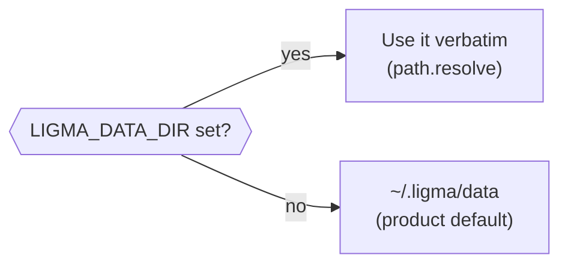

# Configuration

Audience: the operator running the daemon (day-to-day, that's Alex). Covers
every first-party environment variable, the `daemon-config.json` schema, how
to point the daemon at a different backend, and the CLI.

This file transcribes `apps/daemon/src/engine/config.ts` (config schema) and
`apps/daemon/src/paths.ts` (path resolution) — treat those two files as the
canonical source if this page and the code ever disagree.

---

## 1. Environment variables

### Paths & process roots

| Variable | Default | What it moves |
|---|---|---|
| `LIGMA_DATA_DIR` | `~/.ligma/data` | The JSON store root (tasks, projects, decisions, contracts, …). Strictly local; a checkout's `data/` is gitignored wholesale — see §4. |
| `LIGMA_ENVS_DIR` | `~/.ligma/envs` | Ephemeral verification worktrees (one full git worktree per run). |
| `LIGMA_PRODUCTS_DIR` | `~/ligma-products` | Where greenfield product repos get created (`<dir>/<slug>`). |
| `LIGMA_REPO_ROOT` | the checkout `apps/daemon/src/paths.ts` resolves from | The ligma monorepo root; also where ephemeral-env worktrees are cut from. |
| `LIGMA_WORKSPACE_ROOT` | `REPO_ROOT/..` | The directory containing the checkout — used to resolve sibling repos. |
| `LIGMA_CRAFT_DIR` | `<repo>/craft` | The craft rule-file directory the studio critic reads. |
| `LIGMA_DESIGN_SYSTEMS_DIR` | `<repo>/design-systems` | The vendored design-system catalog root. |
| `LIGMA_SKILLS_DIR` | `<repo>/skills` | The **vendored** (read-only) half of the skill catalog. `/api/skill-catalog` serves it overlaid with `<DATA_DIR>/skills`, where user-authored skills are written; an authored id shadows a vendored one. |
| `LIGMA_DAEMON_PORT` | `4477` | The daemon's HTTP port (binds `127.0.0.1` only). |
| `NEXT_PUBLIC_LIGMA_DAEMON_URL` | `http://127.0.0.1:4477` | Where the web app's `/api/*` rewrite points (`apps/web/next.config.ts`). Only needs setting if the daemon runs on a non-default port or host. |

### Auth (legacy naming, proxy-only — see §3)

| Variable | Default | Notes |
|---|---|---|
| `MC_API_TOKEN` | unset | Checked by `apps/web/src/middleware.ts` on the Next.js side only. Named `MC_*` from the pre-merger product; not renamed yet (rebrand wave 2, see `docs/audits/fix-campaign-2026-08-27.md` decision 7). |
| `NEXT_PUBLIC_MC_API_TOKEN` | unset | The browser-side twin of the above — ships in the client JS bundle by construction (any `NEXT_PUBLIC_*` var does). |

### Backend/model overrides and dev-only flags

These exist mostly for tests, local development, and the `smoke-models`
script — not needed for normal operation (use `daemon-config.json` instead,
§2):

| Variable | Purpose |
|---|---|
| `LIGMA_DISCOVERY_STUB` | Set to `1` to make discovery answer from a stub instead of spawning a model — used by e2e tests so `pnpm test:e2e` spends no quota. |
| `LIGMA_STUB_STUDIO` | Equivalent stub for the studio generation path. |
| `LIGMA_SPAWN_ROLE` | Set on a spawned CLI's environment so its stdout parser knows which role invoked it (builder/persona/judge/…). Internal — not meant to be set by hand. |
| `LIGMA_STUDIO_MODEL`, `LIGMA_STUDIO_PLANNER_MODEL`, `LIGMA_STUDIO_CRITIC_MODEL`, `LIGMA_STUDIO_CRITIQUE_LANES` | Override the studio's model/lane choices without editing config — mainly used from scripts and tests. |
| `LIGMA_ENV_HEALTH_TIMEOUT_MS` | Override the ephemeral-env boot health-check budget (default 120000ms). |
| `LIGMA_SMOKE_DIGEST_CRON` | Cron override for the `smoke-models` digest schedule. |
| `LIGMA_E2E_CLASSIC` | Gates a test suite that boots the legacy `ligma-classic` checkout end to end — set only in that suite's own environment. |
| `VERIFICATION_RUNS_DIR`, `CONTRACTS_DIR`, `MC_GOVERNOR_DATA_DIR`, `MC_RUN_OUTPUTS_DIR` | Test-only redirects for the verification/governor stores (vitest sets these to a scratch dir per test file). Not operator-facing. |
| `LIGMA_CHROME_PATH` | Override the Chrome binary the exporters launch for PDF/PNG rendering (`packages/exporters/src/chrome-discovery.ts`). |
| `CODESIGN_CHROME_PATH` | Legacy alias for `LIGMA_CHROME_PATH`, read only when the new name is unset — kept readable under its pre-rebrand name; see decision 7 in the fix-campaign contract. |

Everything above is exhaustive as of this writing (checked with a repo-wide
`process.env.*` scan across `apps/*/src` and `packages/*/src`, excluding
vendored/test-framework noise); a var this table is missing was added after
this page — check `paths.ts` and `config.ts` first.

---

## 2. `daemon-config.json` field reference

Location: `<LIGMA_DATA_DIR>/daemon-config.json`. Created with defaults on
first daemon start if missing (`loadConfig()` in `config.ts`). Six top-level
sections; every field is validated on load — an invalid value is silently
dropped in favor of the last-known-good/default value, never crashes the
daemon.

### `polling`

| Field | Type | Notes |
|---|---|---|
| `enabled` | boolean | Turns the dispatcher's poll loop on/off. |
| `intervalMinutes` | number, 1–60 | How often the dispatcher checks for dispatchable work. |

### `concurrency`

| Field | Type | Notes |
|---|---|---|
| `maxParallelAgents` | number, 1–10 | Cap on simultaneously in-flight builder sessions. |

### `schedule`

A map of named cron jobs (`dailyPlan`, `standup`, `brainDumpTriage`,
`weeklyReview` by default; you can add your own keys). Each entry:

| Field | Type | Notes |
|---|---|---|
| `enabled` | boolean | |
| `cron` | string | Standard 5-field cron expression. |
| `command` | string | Which scheduled-command handler to run. |

### `execution`

The largest section — builder/backend behavior and the acceptance harness.

| Field | Type | Notes |
|---|---|---|
| `maxTurns` | number, 1–100 | Turn budget per agent session. |
| `timeoutMinutes` | number, 1–120 | Wall-clock timeout per session. |
| `retries` | number, 0–5 | Build retry attempts on failure. |
| `retryDelayMinutes` | number, 1–30 | Delay before a queued retry fires. |
| `skipPermissions` | boolean | Bypasses Claude Code's permission prompts — logged as a security warning on load when true. |
| `allowedTools` | string[] | Tool grant for the **builder** role (see `toolsForRole()` in `config.ts`; non-builder roles get a fixed `Read`/`Edit`/`Write` grant regardless of this field). |
| `agentTeams` | boolean | Enables multi-agent team mode for a build session. |
| `backendMode` | `"claude" \| "mixed" \| "codex" \| "gemini"` | Which CLI backend builds tasks. See §3. |
| `claudeBinaryPath`, `codexBinaryPath`, `geminiBinaryPath` | string \| null | Explicit binary path override per backend; `null` = autodetect via PATH. |
| `codexTaskTags`, `geminiTaskTags` | string[] | Task tags that route an individual task to that backend under `backendMode: "mixed"`. |
| `codexModel`, `geminiModel` | string \| null | Model override per backend. |
| `claudeAutoFailoverEnabled` | boolean | Whether a string of Claude failures triggers failover to another backend. |
| `claudeAutoFailoverThreshold` | number, 1–10 | Consecutive failures before failover triggers. |
| `claudeAutoFailoverBackend` | `"codex" \| "gemini" \| null` | Which backend to fail over to. |
| `workerModel` | string \| null | Model alias for worker/persona spawns (defaults to a cheap model — build-brief policy is cheaper models for more mechanical roles). |
| `memory.enabled`, `memory.maxEntries` (1–500) | boolean, number | Cross-session agent memory. |
| `harness.autoVerify` | boolean | Whether a completed build auto-triggers verification. |
| `harness.maxParallelPersonas` | number, 1–8 | Persona panel size per verification run. |
| `harness.naiveUserRuns` | number, 1–5 | How many of the panel are naive-user walkers vs. targeted personas. |
| `harness.maxVerificationAttempts` | number, 1–10 | The cap that raises a decision card when exhausted. |
| `harness.judgeModel`, `harness.personaModel` | string \| null | Model overrides for the judge and persona spawns. |
| `governor.enabled` | boolean | Master switch for the quota governor. |
| `governor.windowHours` | number, 1–168 | Rolling window the session cap applies over. |
| `governor.maxSessionsPerWindow` | number, 1–1000 | Sessions allowed per window across all roles. |
| `governor.reservePercent` | number, 0–100 | Sessions reserved (not spendable by low-priority roles) within the window. |
| `governor.killSwitch` | boolean | Stops new spawns immediately when true (see the E9 caveat in the codebase audit: two engine paths currently bypass this — a code fix, not a config one). |
| `governor.roleRouting.{builder,persona,judge,scheduled,human}` | `"claude" \| "codex" \| "gemini"` | Which backend serves each role (`builder`/`persona`/`judge` required, `scheduled`/`human` optional — see `apps/daemon/src/engine/types.ts`). Routing the judge off Claude is accepted by validation today but not honored by the harness (`harness/judge.ts`) — leave it on `claude`. |

### `storage`

| Field | Type | Notes |
|---|---|---|
| `productsDir` | string \| null | Overrides `LIGMA_PRODUCTS_DIR`/the default `~/ligma-products` root for greenfield product repos. |

### `notifications`

| Field | Type | Notes |
|---|---|---|
| `desktopEnabled` | boolean | OS desktop notifications for daemon events. |

---

## 3. Backend setup (Claude / Codex / Gemini)

The daemon drives whichever CLI `execution.backendMode` names — it shells out
to the installed `claude`, `codex`, or `gemini` binary the same way you would
from a terminal. There is no separate API-key config for this: each CLI
handles its own auth (Claude Code's own login, Codex's own login, etc.) the
same as if you'd run it yourself.

To switch backends:

1. Make sure the target CLI is installed and on `PATH` (or set its
   `*BinaryPath` field in `daemon-config.json` if it isn't).
2. Set `execution.backendMode` to `"claude"`, `"codex"`, `"gemini"`, or
   `"mixed"` (routes per-task via `codexTaskTags`/`geminiTaskTags`).
3. Optionally pin `execution.codexModel` / `execution.geminiModel`.
4. Restart the daemon — binary paths are probed and cached at process start
   (`GET /api/backends` reports what's currently detected; `POST
   /api/backends/rescan` re-probes without a restart, though a changed
   *binary path* still needs a restart to take effect).

The web app's Settings → Models/Backends cards write this same config
through the daemon's HTTP API — using them is equivalent to hand-editing
`daemon-config.json`.

The judge role should stay routed to Claude (`governor.roleRouting.judge`):
routing it elsewhere passes config validation but fails every verification at
runtime (see the codebase audit's E6 finding — a known gap, not a supported
configuration).

---

## 4. Data-root resolution

The daemon resolves its store once at boot: `LIGMA_DATA_DIR` if set, else
`~/.ligma/data`. A checkout's `data/` directory is gitignored wholesale — the
store is personal, local state and is never committed. To dogfood a daemon out
of a checkout, export `LIGMA_DATA_DIR` yourself (e.g.
`LIGMA_DATA_DIR=./data pnpm --filter @ligma/daemon dev`).



---

## 5. CLI (`ligma`)

Package: `apps/cli` (`@ligma/cli`), binary name `ligma`. Talks to the daemon
over the same HTTP API the web app uses (`@ligma/api`'s route constants), so
anything the CLI can do, a script can also do directly with `curl` against
the same routes.

```
Usage: ligma <command> [options]

Commands:
  projects list                    List projects
  runs list                        List active runs
  runs tail <runId>                Tail a run's output (live, Ctrl-C to stop)
  decisions list                   List decisions
  decisions answer <id> <option>   Answer a pending decision

Options:
  --port <port>   Daemon port (default: $LIGMA_DAEMON_PORT or 4477)
  -h, --help      Show this help
```

Example:

```sh
ligma decisions list
ligma decisions answer dec_abc123 "Send back to the builder"
ligma runs tail run_abc123
```

Ctrl-C only cleanly cancels `runs tail` today — other commands don't thread
the abort signal through yet (codebase audit finding D7).

---

## 6. Known gaps in this area (flagged, not fixed by this doc)

- **No auth on the daemon's HTTP API.** It binds `127.0.0.1` only, but accepts
  unauthenticated requests directly; `MC_API_TOKEN`/`NEXT_PUBLIC_MC_API_TOKEN`
  gate the *Next.js proxy* only, not the daemon port itself, so anything that
  can reach `127.0.0.1:4477` bypasses the token entirely. Accepted for a
  local-first, single-user tool — see `docs/audits/fix-campaign-2026-08-27.md`
  decision 6, and codebase-audit findings W13/W14/P20.
- Mutating routes are being hardened to require `content-type:
  application/json` (blocks the plain HTML-form-POST attack class) as part of
  that same decision — a code change, not a config one.
- **e2e tests run against a throwaway data dir, not the dogfood store**
  (fixed since codebase audit finding X21): `apps/web/playwright.config.ts`
  points the daemon it spawns at `LIGMA_E2E_DATA_DIR` (default
  `<os tmpdir>/ligma-e2e-data`), starting the daemon via `exec tsx
  src/server.ts` with that env set explicitly. `apps/web/e2e` runs on this checkout
  no longer touch real local data.
